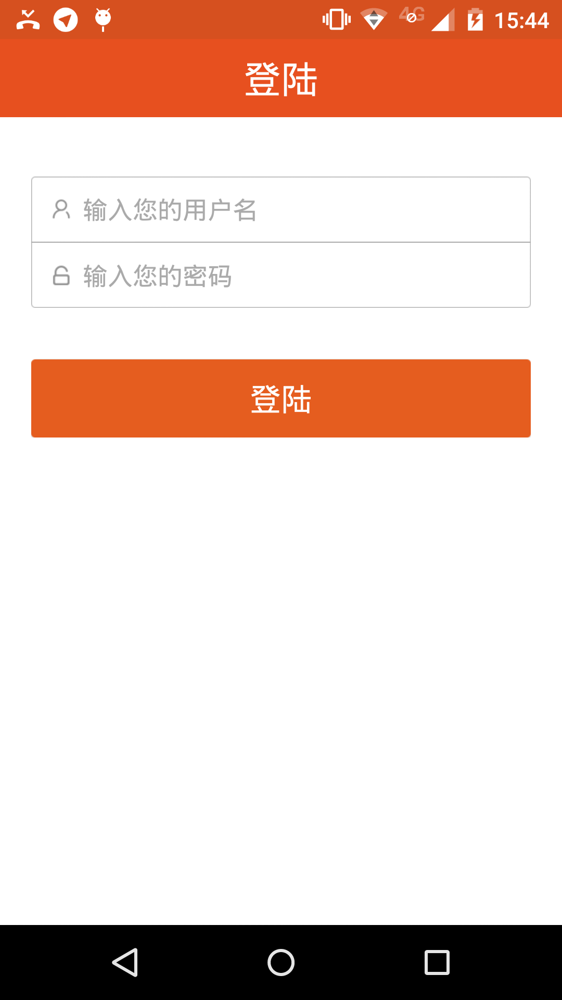
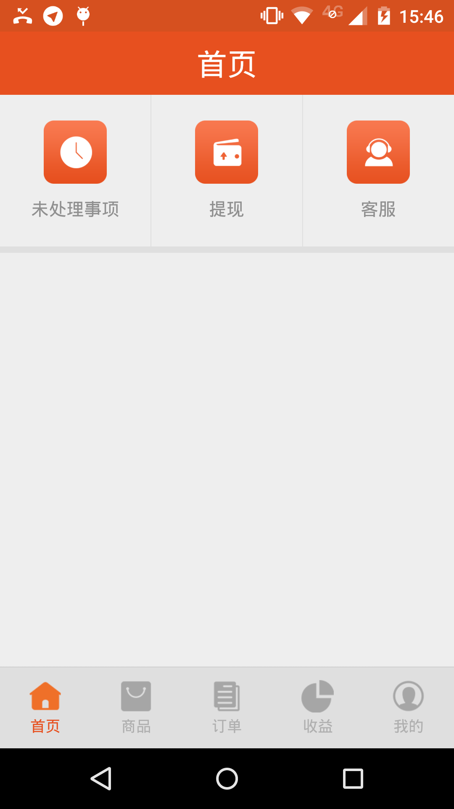
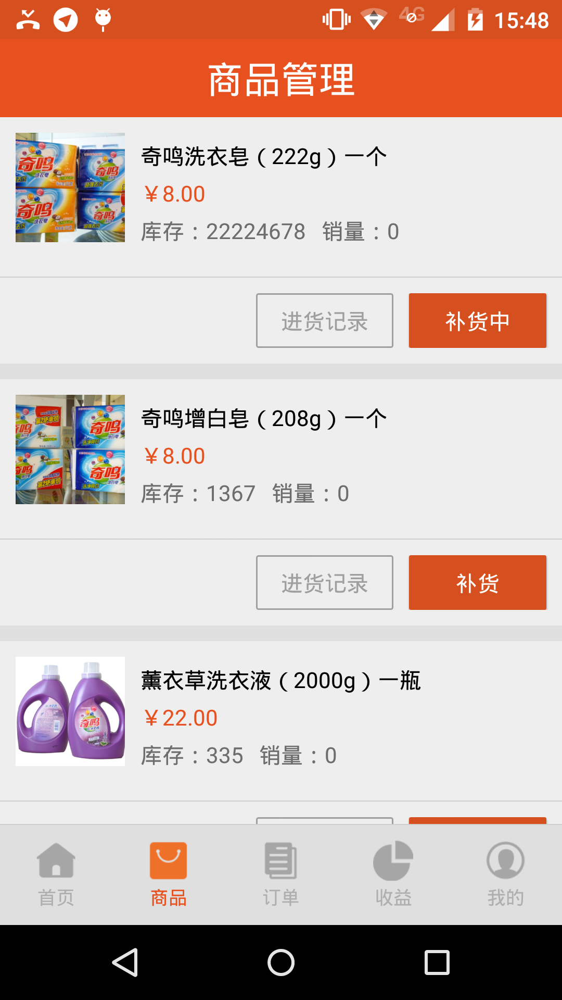
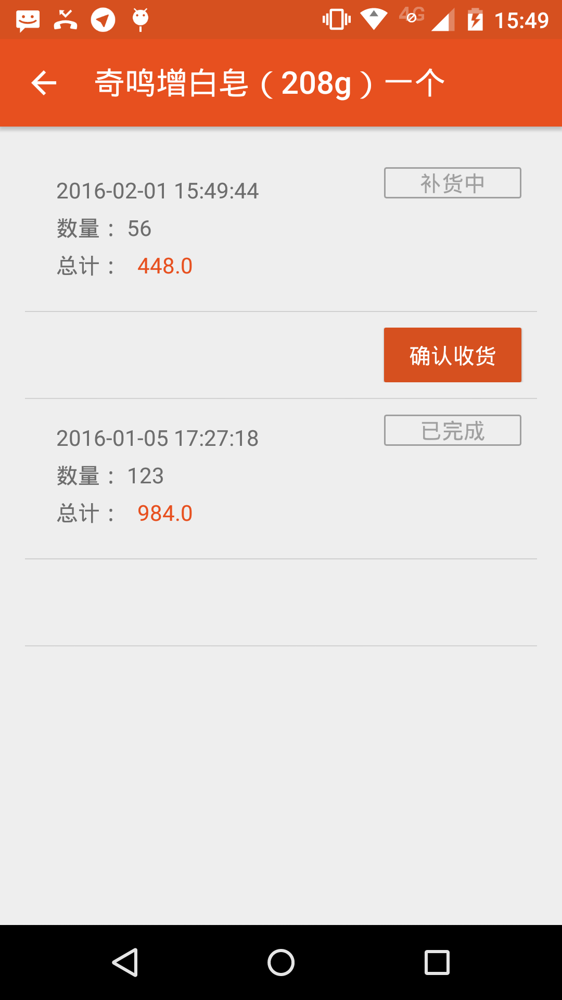
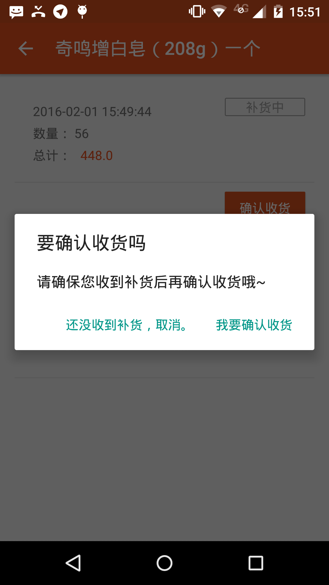
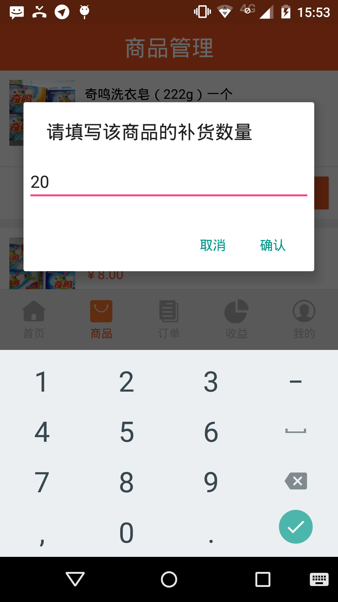
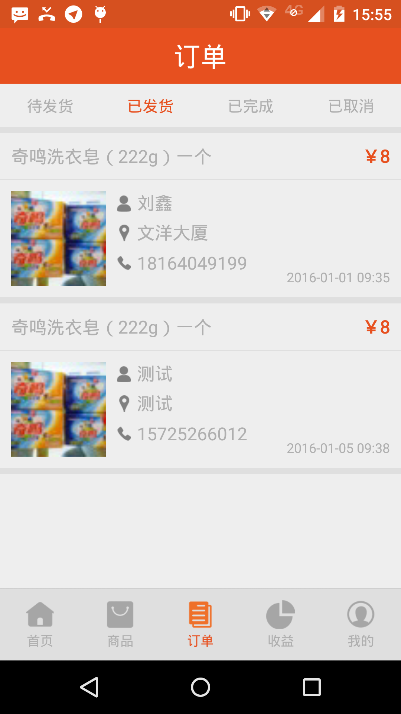
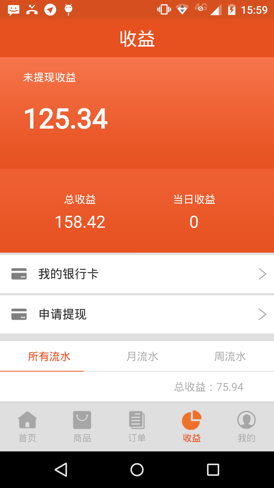
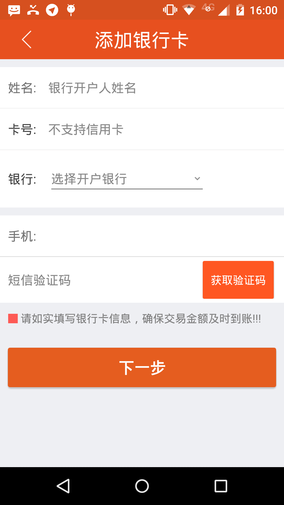
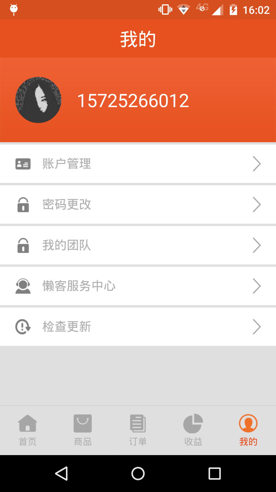

# 商家版懒客图文使用教程 #
1. 用户名登陆
2. 登陆完成进入主页，首页会展示未处理订单
3. 商品tab展示了懒客点在销售的商品,点击进货记录，可以查看该商品的进货记录，在进货记录内点未完成的进货订单点击确认收货完成补货流程，在商品管理页点击对应商品的补货按钮进行补货，此时要填写补货数量，点击确认，补货记录内就会多一条补货记录。
4. 点击订单，进入订单列表页，展示，已完成，等待发货，已发货，已取消订单。
5. 点击收益，可查看收益总额，以及具体的收益流水，可以绑定银行卡，进行提现等操作。，提现时首先需要绑定银行卡，请如实填写银行卡信息。
6. 我的tab里面主要涉及了商家的个人信息，有账户管理，更改初始密码等操作。

